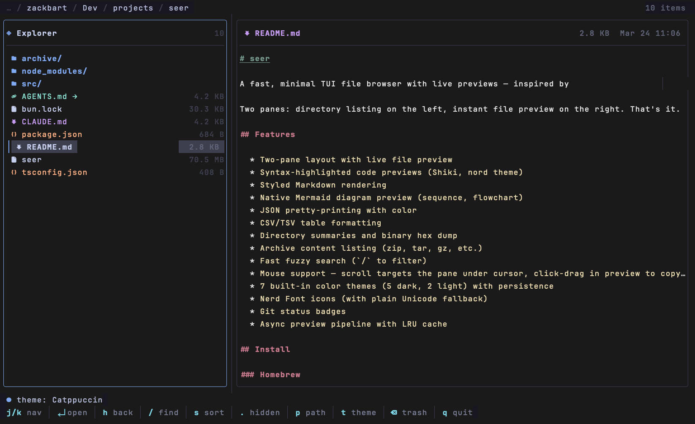
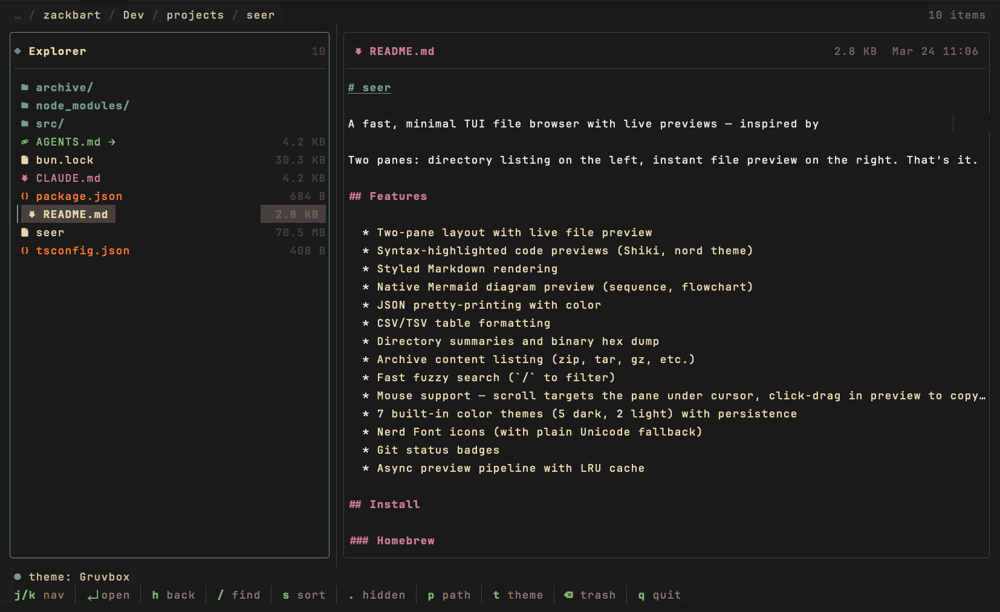

# seer

A fast, minimal TUI file browser with live previews - inspired by [Yazi](https://github.com/sxyazi/yazi).

Two panes: directory listing on the left, instant file preview on the right. That's it.





## Features

- Two-pane layout with live file preview
- Syntax-highlighted code previews (Shiki, nord theme)
- Styled Markdown rendering
- Native Mermaid diagram preview (sequence, flowchart)
- JSON pretty-printing with color
- CSV/TSV table formatting
- Directory summaries and binary hex dump
- Archive content listing (zip, tar, gz, etc.)
- Fast fuzzy search (`/` to filter)
- Mouse support - scroll targets the pane under cursor, click-drag in preview to copy text
- 9 built-in color themes (7 dark, 2 light) with persistence
- Nerd Font icons (with plain Unicode fallback)
- Git status badges
- Async preview pipeline with LRU cache

## Install

### Homebrew

```bash
brew install zackbart/tap/seer
```

### From source

Requires [Bun](https://bun.sh).

```bash
git clone https://github.com/zackbart/seer.git
cd seer
bun install
bun run build
# ./seer is now a standalone binary
```

## Usage

```bash
seer              # Browse current directory
seer /some/path   # Browse a specific directory
seer --version    # Print version
seer --help       # Show help
```

### Shell cd integration

Add to `~/.bashrc` or `~/.zshrc` so quitting seer drops you into the last directory you browsed:

```bash
function s() {
  local tmp=$(mktemp)
  command seer --cwd-file="$tmp" "$@"
  local dir=$(cat "$tmp" 2>/dev/null)
  rm -f "$tmp"
  [[ -n "$dir" && -d "$dir" ]] && cd "$dir"
}
```

## Controls

| Key | Action |
|---|---|
| `j` / `k` | Move up / down |
| `enter` / `l` | Open directory |
| `h` | Parent directory |
| `g` / `G` | Jump to top / bottom |
| `/` | Fuzzy search |
| `.` | Toggle hidden files |
| `s` | Cycle sort mode |
| `t` | Cycle color theme |
| `p` | Copy file path to clipboard |
| `<` / `>` | Resize panes |
| `R` | Reload directory |
| `backspace` | Move to trash (with confirmation) |
| `q` / `ctrl+c` | Quit |

**Mouse**: scroll to navigate either pane, click-drag in preview to select and copy text.

## Themes

Press `t` to cycle through themes. Your choice is saved to `~/.config/seer/theme`.

- Tokyo Night (default)
- Catppuccin Mocha
- Rosé Pine
- Gruvbox
- Nord
- GitHub Light
- Solarized Light

## Environment Variables

| Variable | Effect |
|---|---|
| `SEER_NO_NERD_FONT=1` | Use plain Unicode instead of Nerd Font glyphs |

## Supported Formats

- **Code**: Go, JS/TS, Python, Rust, C/C++, Ruby, Java, and many more (via Shiki)
- **Markup**: Markdown, MDX, RST
- **Data**: JSON, YAML, TOML, CSV, TSV, INI, ENV
- **Diagrams**: Mermaid (`.mmd`)
- **Archives**: zip, tar, gz, bz2, xz, 7z, rar
- **Directories**: file count, item listing
- **Binary**: hex dump with offset

## License

MIT
